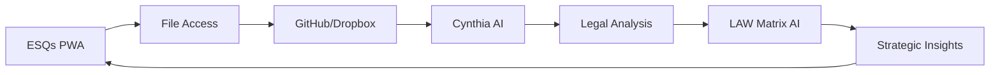

# ESQs - Enhanced Synthesized Quintessential System

**Progressive Web App for Legal Intelligence** 🏛️⚖️🤖

[](https://web.dev/progressive-web-apps/)
[](./sw.js)
[](./ai-router.js)
[](./lexis-integration.js)

---

## 🚀 Quick Start

### ⚡ Instant Access (Recommended)
```bash
# 🌐 Open ESQs directly in browser
https://bcls-esqs.github.io/boyack-christiansen-Enhanced-Synthizied-Quintessential-System-ESQs/
```

### 🛠️ Local Development
```bash
# Clone and launch
git clone https://github.com/BCLS-ESQs/boyack-christiansen-Enhanced-Synthizied-Quintessential-System-ESQs.git
cd boyack-christiansen-Enhanced-Synthizied-Quintessential-System-ESQs

# Launch with platform-specific scripts
./launch-esqs.sh --local          # 🐧 Linux/macOS
launch-esqs.bat --local           # 🪟 Windows (CMD)
.\launch-esqs.ps1 -Local          # 🪟 Windows (PowerShell)
```

---

## 📱 Progressive Web App Features

- **🌐 Cross-Platform**: Works on desktop, tablet, and mobile
- **📴 Offline Support**: Full functionality without internet
- **📱 Native Feel**: Install as app on any device
- **🔄 Auto-Updates**: Always latest version when online
- **🔒 Secure**: Service worker with caching strategies

### PWA Installation
| Platform | Method |
|----------|--------|
| **Chrome/Edge** | Click install icon (⊕) in address bar |
| **Firefox** | Menu ☰ → "Install this site as an app" |
| **Safari** | File → "Add to Dock" |
| **Mobile** | Share → "Add to Home Screen" |

---

## 🤖 Cynthia AI Legal Assistant

**Multi-AI Synthesis Engine** combining:
- 🧠 **Claude**: Legal reasoning and analysis
- 💡 **OpenAI GPT**: Document generation and research
- 🔍 **Gemini**: Case law synthesis and insights

### Features
- ⚖️ **Legal Analysis**: Case review and strategy
- 📝 **Document Drafting**: Motions, briefs, contracts
- 🏛️ **Utah Law Focus**: Specialized jurisdiction knowledge
- 👨‍⚖️ **Judicial Intelligence**: Judge-specific insights
- 📊 **Billing Integration**: Automatic time tracking

---

## 🔗 Integrated Platforms

### GitHub Integration 
- 📁 **F--Drive Repository**: Direct file access
- 🔄 **Version Control**: Document history tracking
- 👥 **Collaboration**: Multi-user legal workflows

### Dropbox Integration
- 📂 **PracticePanther Files**: Legal document sync
- 🗂️ **Client Folders**: Organized case management
- 💾 **Auto-Archive**: Session and document backup

### Lexis Nexis Integration
- 📚 **Legal Research**: Comprehensive case law search
- 🏛️ **Utah Jurisdiction**: State-specific focus
- 👨‍⚖️ **Judicial Profiles**: Judge research and intelligence
- 📈 **Citation Analysis**: Authority and relevance scoring

### PracticePanther Integration
- ⏱️ **Billing Timer**: Automatic time tracking
- 📊 **Activity Logging**: Detailed work documentation
- 💰 **Billing Reports**: Integration with practice management
- 🧠 **AI-Enhanced**: ESQs assistance notation

---

## 🛠️ Launcher Scripts

### 🐧 Linux/macOS: `launch-esqs.sh`
```bash
./launch-esqs.sh [option]

Options:
  --local, -l     🚀 Launch local development server
  --web, -w       🌐 Open web version
  --status, -s    📊 Check system status
  --test, -t      🧪 Run integration tests
  --install, -i   📱 PWA installation guide
  --help, -h      ❓ Show help
```

### 🪟 Windows: `launch-esqs.bat` / `launch-esqs.ps1`
```cmd
# Command Prompt
launch-esqs.bat --local

# PowerShell
.\launch-esqs.ps1 -Local
```

---

## 🧪 Integration Testing

Comprehensive testing suite for all integrations:

```bash
# Run all integration tests
./launch-esqs.sh --test

# Or in browser console
await testESQsIntegrations();
```

### Test Coverage
- ✅ **PWA Functionality**: Service worker, manifest, offline support
- ✅ **GitHub Integration**: Repository access and file patterns  
- ✅ **Dropbox Integration**: PracticePanther sync and archiving
- ✅ **Lexis Integration**: Legal research and judicial intelligence
- ✅ **Billing Integration**: PracticePanther timer and tracking
- ✅ **Synthia Codes**: AI assistant and interface components

---

## 🔐 API Configuration

Set your AI service API keys via browser console:

```javascript
// In browser console (F12)
window.ESQS_API_KEYS = {
    OPENAI_API_KEY: 'sk-your-openai-key',
    CLAUDE_API_KEY: 'sk-your-claude-key',
    GEMINI_API_KEY: 'your-gemini-key'
};
```

### API Key Sources
- **OpenAI**: https://platform.openai.com/api-keys
- **Claude**: https://console.anthropic.com/
- **Gemini**: https://makersuite.google.com/app/apikey

---

## 🤖 Synthia Code Locations

Synthia's AI code is distributed across multiple files:

| File | Synthia Components |
|------|-------------------|
| `index.html` | 🎭 Visual interface, chat system, Cynthia face avatar |
| `ai-router.js` | 🧠 Multi-AI synthesis, routing logic, token management |
| `esqs-session-manager.js` | 📊 Session intelligence, billing integration |
| `integration-tester.js` | 🧪 Synthia code detection and testing |

### Finding Synthia Code
```javascript
// Search for Synthia references in browser console
const findSynthiaCode = () => {
    ['Cynthia', 'synthia', 'cynthiaInterface', 'aiRouter'].forEach(pattern => {
        console.log(`=== ${pattern.toUpperCase()} REFERENCES ===`);
        Object.keys(window).filter(key => 
            key.toLowerCase().includes(pattern.toLowerCase())
        ).forEach(key => console.log(`window.${key}`));
    });
};
```

---

## ⚠️ Not a CLI Tool

**ESQs is a Progressive Web App, not a command-line tool.**

❌ **Wrong:**
```bash
esqs --help           # This won't work
python esqs.py        # This won't work
```

✅ **Correct:**
```bash
./launch-esqs.sh --help    # Use launcher scripts
```

If you try to run ESQs as a CLI tool, the `esqs` script will redirect you to proper access methods.

---

## 📊 ESQs ↔ LAW Matrix AI Workflow



**Integration Steps:**
1. 🚀 Launch ESQs using launcher scripts
2. 🔐 Configure API keys for AI services
3. 🧪 Test integrations with built-in suite
4. 📁 Access legal files via GitHub/Dropbox
5. 🤖 Process with Cynthia for AI analysis
6. 📊 Export insights to LAW Matrix system

---

## 📚 Documentation

- **📖 Setup Guide**: [SETUP.md](./SETUP.md) - Complete installation and configuration
- **🔧 Service Worker**: [sw.js](./sw.js) - PWA offline functionality
- **🧪 Integration Tests**: [integration-tester.js](./integration-tester.js) - Testing suite
- **🤖 AI Router**: [ai-router.js](./ai-router.js) - Multi-AI synthesis engine

---

## 🏛️ Legal Intelligence Features

### Case Analysis
- 📋 **Matter Assessment**: Automated case complexity analysis
- 🎯 **Strategy Planning**: AI-powered legal strategy recommendations
- 📊 **Precedent Research**: Relevant case law identification

### Document Intelligence
- 📝 **Smart Drafting**: AI-assisted document creation
- 🔍 **Content Analysis**: Document review and summarization
- ✅ **Compliance Check**: Regulatory and procedural verification

### Judicial Intelligence
- 👨‍⚖️ **Judge Profiles**: Detailed judicial analysis and preferences
- 📈 **Decision Patterns**: Historical ruling analysis
- 🎯 **Strategy Optimization**: Judge-specific approach recommendations

---

**🌟 ESQs: Where Legal Intelligence Meets Progressive Web Technology**

*Enhanced Synthesized Quintessential System - Transforming Legal Practice Through AI*
