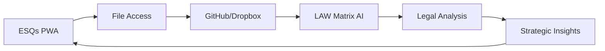

# 🚀 ESQs Progressive Web App Setup Guide

**Enhanced Synthesized Quintessential System**  
*Legal Intelligence Platform - Complete Setup & Access Documentation*

---

## 📱 What is ESQs?

ESQs (Enhanced Synthesized Quintessential System) is a **Progressive Web App (PWA)** that provides:

- 🤖 **Cynthia AI Legal Assistant** - Multi-AI synthesis (OpenAI, Claude, Gemini)
- ⚖️ **Legal Intelligence** - Case analysis, research, document drafting
- 🔗 **Integrated Workflow** - GitHub, Dropbox, Lexis Nexis, PracticePanther
- 📱 **Offline Capability** - Works without internet connection
- 🏛️ **Utah Law Focus** - Specialized for Utah jurisdiction

---

## 🎯 Quick Start

### Option 1: Web Version (Instant Access)
```bash
# Open directly in browser
https://bcls-esqs.github.io/boyack-christiansen-Enhanced-Synthizied-Quintessential-System-ESQs/
```

### Option 2: Local Development
```bash
# Clone repository
git clone https://github.com/BCLS-ESQs/boyack-christiansen-Enhanced-Synthizied-Quintessential-System-ESQs.git
cd boyack-christiansen-Enhanced-Synthizied-Quintessential-System-ESQs

# Launch with provided scripts
./launch-esqs.sh --local          # Linux/macOS
launch-esqs.bat --local           # Windows Command Prompt
.\launch-esqs.ps1 -Local          # Windows PowerShell
```

---

## 🛠️ Installation Methods

### 📊 Platform Compatibility Matrix

| Platform | Launcher Script | PWA Install | Offline Support |
|----------|----------------|-------------|-----------------|
| **Windows** | ✅ `.bat` + `.ps1` | ✅ Chrome/Edge | ✅ Full |
| **macOS** | ✅ `.sh` | ✅ Safari/Chrome | ✅ Full |
| **Linux** | ✅ `.sh` | ✅ Chrome/Firefox | ✅ Full |
| **iOS** | ➖ Web only | ✅ Safari | ✅ Full |
| **Android** | ➖ Web only | ✅ Chrome | ✅ Full |

### 💻 Desktop Installation

#### Chrome, Edge, Brave
1. Open ESQs in browser
2. Look for **install icon (⊕)** in address bar
3. Click **"Install"** in popup
4. ESQs will appear as native app

#### Firefox
1. Open ESQs in browser
2. Click menu **☰** → **"Install this site as an app"**
3. Follow installation prompts

#### Safari (macOS)
1. Open ESQs in Safari
2. **File** → **"Add to Dock"**
3. ESQs will be available as app

### 📱 Mobile Installation

#### iOS (iPhone/iPad)
1. Open ESQs in Safari
2. Tap **Share button** 📤
3. Select **"Add to Home Screen"**
4. Tap **"Add"**

#### Android
1. Open ESQs in Chrome
2. Tap **menu ⋮** → **"Add to Home screen"**
3. Or look for **"Install app"** banner

---

## 🎛️ Launcher Scripts

### 🐧 Linux/macOS: `launch-esqs.sh`

```bash
# Make executable
chmod +x launch-esqs.sh

# Usage options
./launch-esqs.sh --local     # Start local server
./launch-esqs.sh --web       # Open web version
./launch-esqs.sh --status    # Check system status
./launch-esqs.sh --install   # Installation guide
./launch-esqs.sh --test      # Run integration tests
./launch-esqs.sh --help      # Show help
```

### 🪟 Windows: `launch-esqs.bat`

```cmd
REM Command Prompt usage
launch-esqs.bat --local      # Start local server
launch-esqs.bat --web        # Open web version
launch-esqs.bat --status     # Check system status
launch-esqs.bat --test       # Run integration tests
```

### ⚡ Windows PowerShell: `launch-esqs.ps1`

```powershell
# PowerShell usage
.\launch-esqs.ps1 -Local     # Start local server
.\launch-esqs.ps1 -Web       # Open web version
.\launch-esqs.ps1 -Status    # Check system status
.\launch-esqs.ps1 -Test      # Run integration tests
.\launch-esqs.ps1 -Help      # Show help
```

---

## 🔧 System Requirements

### Minimum Requirements
- **Browser**: Chrome 88+, Firefox 85+, Safari 14+, Edge 88+
- **RAM**: 2GB available
- **Storage**: 500MB for offline cache
- **Network**: Internet for initial setup

### Recommended for Development
- **Python**: 3.7+ (for local server)
- **RAM**: 4GB+ available
- **Storage**: 2GB+ for full caching
- **Browser**: Latest Chrome/Edge (best PWA support)

### Dependencies Check
```bash
# Check Python (required for local development)
python --version   # or python3 --version

# Check browser support
# Open browser and visit: https://whatwebcando.today/
```

---

## 🔐 API Configuration

ESQs integrates with multiple AI services. Set your API keys via browser console:

```javascript
// In browser console (F12)
window.ESQS_API_KEYS = {
    OPENAI_API_KEY: 'sk-your-openai-key',
    CLAUDE_API_KEY: 'sk-your-claude-key', 
    GEMINI_API_KEY: 'your-gemini-key'
};

// Verify configuration
console.log('API keys configured:', Object.keys(window.ESQS_API_KEYS));
```

### 🔑 Where to Get API Keys

| Service | URL | Notes |
|---------|-----|-------|
| **OpenAI** | https://platform.openai.com/api-keys | GPT-4, document generation |
| **Claude** | https://console.anthropic.com/ | Legal analysis, reasoning |
| **Gemini** | https://makersuite.google.com/app/apikey | Research, synthesis |

---

## 🧪 Integration Testing

ESQs includes comprehensive integration testing:

### Quick Test
```bash
# Using launcher scripts
./launch-esqs.sh --test      # Linux/macOS
launch-esqs.bat --test       # Windows
.\launch-esqs.ps1 -Test      # PowerShell
```

### Manual Testing
```javascript
// In browser console after opening ESQs
await testESQsIntegrations();

// Individual integration tests
window.esqsIntegrationTester.testPWAFunctionality();
window.esqsIntegrationTester.testGitHubIntegration();
window.esqsIntegrationTester.testDropboxIntegration();
```

### Integration Checklist
- ✅ **GitHub Integration**: BCLS-ESQs/F--Drive repository access
- ✅ **Dropbox Integration**: PracticePanther legal files sync
- ✅ **Lexis Nexis**: Legal research and judicial intelligence
- ✅ **PracticePanther**: Billing timer and session management
- ✅ **PWA Features**: Offline support, installation, notifications

---

## 🤖 Accessing Synthia Codes

**Synthia** is ESQs's AI legal assistant. Her codes are distributed across:

### 📁 Core Synthia Files
```
index.html              # Main Cynthia interface & visual components
├── Cynthia Face        # Interactive AI avatar
├── Response System     # Multi-AI synthesis engine
└── Chat Interface      # Legal conversation UI

ai-router.js            # AI routing and synthesis logic
├── Provider Selection  # OpenAI, Claude, Gemini routing
├── Token Management    # Usage optimization  
└── Response Synthesis  # Multi-AI combination

esqs-session-manager.js # Session & billing integration
├── Client Intelligence # Previous session analysis
├── Activity Logging    # Legal work tracking
└── Billing Integration # PracticePanther sync
```

### 🔍 Finding Synthia Code Patterns
```javascript
// Search for Synthia references in browser console
const findSynthiaCode = () => {
    const patterns = ['Cynthia', 'synthia', 'cynthiaInterface', 'aiRouter'];
    patterns.forEach(pattern => {
        console.log(`=== ${pattern.toUpperCase()} REFERENCES ===`);
        // Search in window object
        Object.keys(window).filter(key => 
            key.toLowerCase().includes(pattern.toLowerCase())
        ).forEach(key => console.log(`window.${key}`));
    });
};

findSynthiaCode();
```

### 🎭 Cynthia Interface Elements
- **Visual Avatar**: `#cynthiaInterface` - Interactive face with animations
- **Chat System**: `.chat-messages` - Legal conversation display  
- **AI Router**: `window.aiRouter` - Multi-AI synthesis engine
- **Response Generator**: `routeQuery()` - Legal query processing

---

## ⚠️ Error Handling & Troubleshooting

### 🚫 "ESQs is not a CLI tool" Error

**If someone tries to run ESQs as a command-line tool:**

```bash
# WRONG - This won't work
esqs --help
python esqs.py

# CORRECT - Use launcher scripts
./launch-esqs.sh --help       # Linux/macOS
launch-esqs.bat --help        # Windows
```

**Error Prevention:**
- ESQs is a **Progressive Web App**, not a CLI tool
- Use provided launcher scripts for command-line access
- Open in browser for web interface

### 🔧 Common Issues & Solutions

| Issue | Solution |
|-------|----------|
| **Port 8080 in use** | Kill existing server: `pkill -f "python.*8080"` |
| **Python not found** | Install from https://python.org/downloads |
| **Service worker fails** | Check if running on localhost or HTTPS |
| **API keys not working** | Verify keys in browser console |
| **Offline not working** | Ensure service worker registered |

### 🩺 System Diagnostics
```bash
# Check ESQs system health
./launch-esqs.sh --status     # Full system check
curl -I http://localhost:8080 # Server health
python -m http.server --help  # Python server check
```

---

## 🔄 Integration Workflow

### ESQs ↔ LAW Matrix AI Integration



**Integration Steps:**
1. **Launch ESQs** using provided scripts
2. **Configure API keys** for AI services
3. **Test integrations** with built-in tester
4. **Access legal files** via GitHub/Dropbox
5. **Process with Cynthia** for AI analysis
6. **Export insights** to LAW Matrix system

### 📊 Workflow Verification
```javascript
// Verify full integration workflow
const verifyWorkflow = async () => {
    console.log('🔍 Verifying ESQs → LAW Matrix integration...');
    
    // 1. Check file access
    const fileAccess = await window.esqsIntegrationTester.testGitHubIntegration();
    
    // 2. Check AI processing
    const aiResponse = await window.aiRouter.routeQuery('Test legal query');
    
    // 3. Check session tracking
    const session = await window.sessionManager?.startClientSession('TestClient');
    
    console.log('✅ Workflow verification complete');
    return { fileAccess, aiResponse, session };
};

// Run verification
verifyWorkflow();
```

---

## 📚 Additional Resources

### 🎓 Learning Resources
- **ESQs User Guide**: Available in app help section
- **PWA Documentation**: https://web.dev/progressive-web-apps/
- **Legal AI Best Practices**: In-app tutorial system

### 🆘 Support & Documentation
- **Integration Issues**: Use `--test` flag with launcher scripts
- **API Configuration**: Browser console documentation
- **File Access**: GitHub/Dropbox integration guides

### 🔄 Updates & Maintenance
- **Automatic Updates**: PWA updates automatically
- **Manual Refresh**: Clear browser cache if needed
- **Version Check**: Available in ESQs settings panel

---

## ✅ Setup Verification Checklist

- [ ] **PWA Installation**: ESQs installed as app
- [ ] **Launcher Scripts**: Scripts executable and working
- [ ] **API Configuration**: Keys set and tested
- [ ] **Integration Testing**: All tests passing
- [ ] **File Access**: GitHub/Dropbox connectivity verified
- [ ] **Cynthia Interface**: AI assistant responding
- [ ] **Offline Mode**: Service worker registered
- [ ] **Session Management**: Billing and tracking active

**🎉 Once all items are checked, ESQs is ready for legal intelligence work!**

---

*This documentation covers the complete setup and access procedures for the ESQs Progressive Web App. For specific legal use cases or advanced configuration, refer to the in-app help system or integration testing tools.*